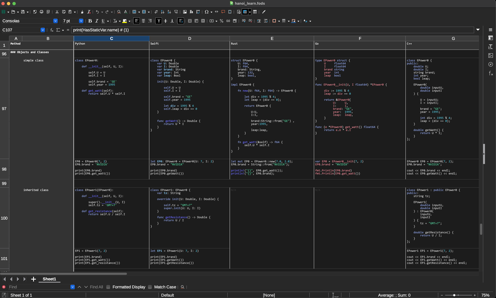

### Learn Swift, Rust, Go, C++, Java like a chad, at the same time 🥴 (for Python devs with 35+ years exp).

This is a work in progress and still a fukcing mess. Anyway:
- The super spreadsheet is located at `docs/hanoi_learn.fods`.
- To run example, run `make <lang>` (e.g: `make rust`)

Have fun, chads 🥴

